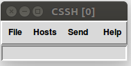

# Readme

Cette interface permet de déployer spark sur un cluster de machines physiques (reliées en réseau), à l'aide de ClusterSSH. 

## Pré-requis
Il faut avoir installer spark sur sa propre machine et disposer desarchives de spark et scala, pre-build, au format tar.gz. Ces archives doivent être disposées à la racine du projet.

Disposer du fichier contenant une liste des machines sur lesquels déployer spark. Cette liste devra être de la forme nom d'utilisteur suivi de l'adresse IP :
	
	jim 192.168.25.2
	tac 156.125.1.4

## Utilisation
L'interface est assez dirigée. 
Dans un premier il s'agit de renseigner l'adresse IP du master ainsi que l'emplacement du dossier spark.

Une fois que vous appuyez sur le bouton OK, après avoir renseigné l'IP, le bouton pour lancer le master est accessible.

Vous pouvez lancer le master.

Par la suite vous devez sélectionner les machines sur lesquels vous d=voulez déployer spark dans liste de droite. Et ensuite appuyer sur connecter machine.

Le bouton suivant est le bouton déployer spark, il suffit de suivre les étapes et sasir les commandes indiquer dans le terminal cssh.

  

La commande sera automatiquement écrite dans les terminaux de tous les workers.

Le bouton quitter cluster, permet de deconnecter touts les workers et le master.

## Maven configuration
Compil with 

	mvn clean install exec:exec -U